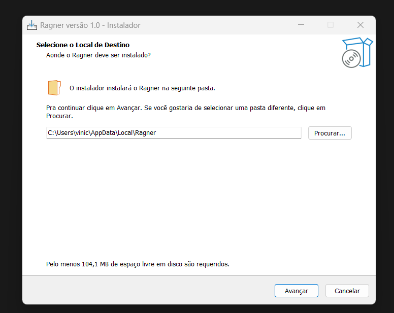
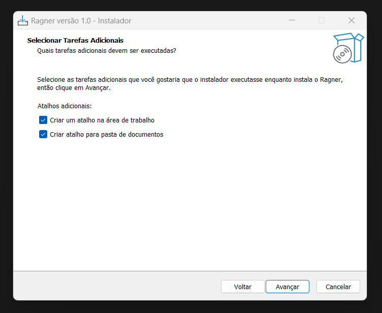
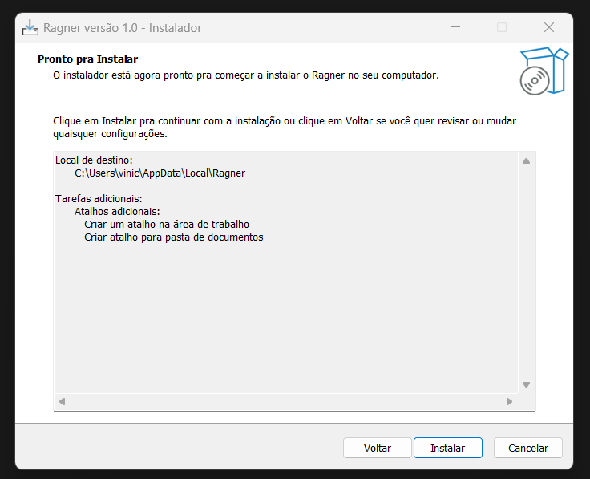
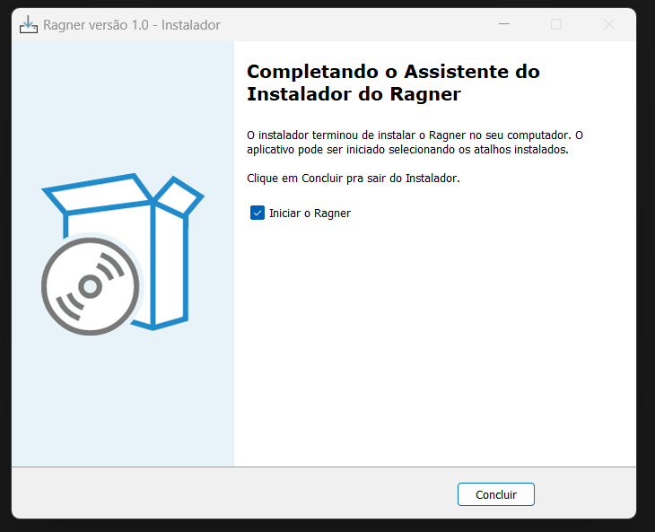
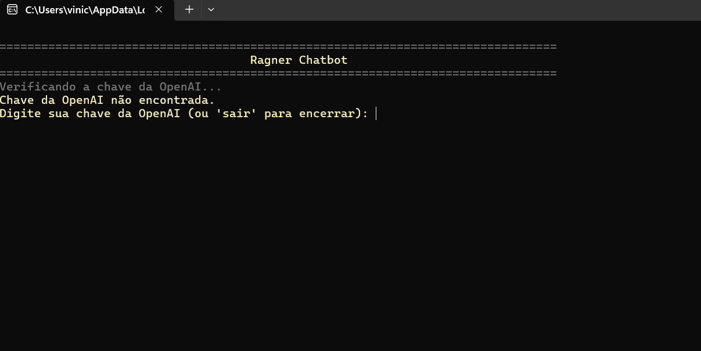
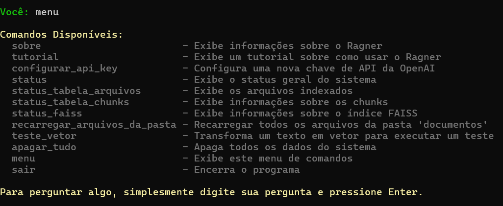

# Ragner: Software Educacional para Desmistificar a IA Generativa Aumentada 

# 📦 Instalação e Configuração


## Opção 1: Download Direto do Instalador

[](installer/Ragner_Setup.exe)

Basta realizar o download do aplicativo, executar o arquivo Ragner_Setup.exe. Este mesmo instalador pode ser usado para a desinstalação do aplicativo após o uso. Por default, o aplicativo é instalado na pasta:
#### C:\Users\SEU USUÁRIO\AppData\Local\Ragner

A instalação é bem simples, e segue os passos abaixo:










Após a instalação, o programa abrirá o terminal automaticamente. Além disso, na sua Área de Trabalho, haverá dois atalhos, um para executar o programa, e outro para a pasta onde você deve adicionar seus arquivos para serem processados pelo RAGNER.

Você pode adicionar os arquivos na pasta antes de abrir o programa, ou, caso o programa já esteja aberto quando você adicionou os arquivos, digitar o comando:

```bash
recarregar_arquivos_da_pasta
```

## Opção 2: Instalação via Python (para desenvolvedores)

```bash
# Clone o repositório
git clone https://github.com/viniciusbuscacio/Ragner.git
cd Ragner

# Instale as dependências
pip install -r requirements.txt

# Execute o programa
python Ragner/Ragner.py
```

---

## 📖 Sobre o Ragner

**Ragner** é um software educacional que ensina **RAG** (Retrieval-Augmented Generation) na prática.

Com ele, você pode:
- 📄 **Indexar seus documentos** (PDF, Word, TXT)
- ❓ **Fazer perguntas** sobre o conteúdo
- 👁️ **Ver cada etapa** do processo RAG acontecendo
- 🧠 **Entender como a IA** encontra e usa informações

É perfeito para estudantes, professores e curiosos que querem entender como funcionam os sistemas de IA modernos!

## 🎯 O Que Este Software Faz

**Ragner** é um software educacional que ensina **RAG** (Retrieval-Augmented Generation) na prática, permitindo que você veja cada etapa do processo acontecendo.

**Na prática, você vai:**
- ✅ Ver como documentos são processados e indexados
- ✅ Entender como perguntas viram vetores matemáticos
- ✅ Acompanhar a busca por informações relevantes
- ✅ Observar como a IA gera respostas baseadas no contexto encontrado

### 🏗️ Tecnologias Usadas
- **Python** com arquitetura limpa
- **FAISS** para busca vetorial rápida
- **OpenAI API** para embeddings e respostas
- **SQLite** para armazenar os textos
- **Interface CLI** simples e didática

## ⚙️ Principais Funcionalidades

### 🔑 Configuração Simples
- Insira sua chave da OpenAI uma vez só
- O sistema salva e valida automaticamente


### 📄 Processa Seus Documentos
- **Formatos aceitos**: PDF, Word (.docx), arquivos de texto
- **Divide inteligentemente** em pedaços menores
- **Transforma em vetores** usando IA da OpenAI
- **Armazena tudo** para busca rápida

### 🔍 Busca Inteligente
- Digite qualquer pergunta em português
- O sistema **encontra** os trechos mais relevantes
- A **IA responde** baseada no que encontrou
- Você **vê as fontes** usadas na resposta

### 🎓 Interface Educativa
- **Tutorial integrado** explica cada conceito
- **Comandos especiais** para testar funcionalidades
- **Explicações detalhadas** de cada etapa
- **Perfeito para aprender** como RAG funciona

## 💻 Como Usar o Ragner

### 🎯 Primeiro Uso
1. **Configure sua chave OpenAI** - O sistema vai pedir na primeira vez
2. **Coloque seus documentos** na pasta `documentos/` 
3. **Indexe os arquivos** - Escolha opção [1] no menu
4. **Faça perguntas** - Escolha opção [2] e digite sua pergunta

### 🖥️ Interface de Linha de Comando
O Ragner usa uma interface de chat simples e direta. Seguem algumas imagens:




