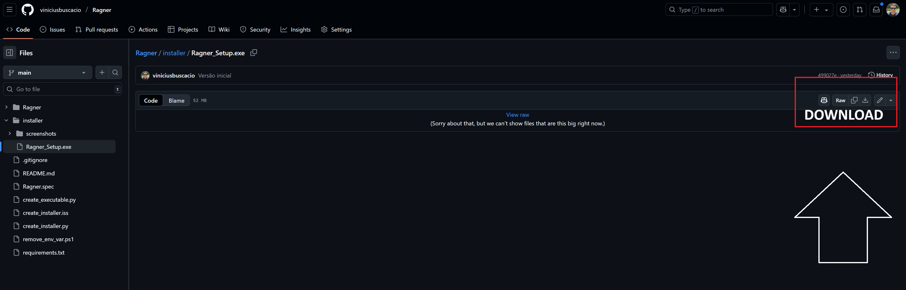
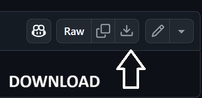
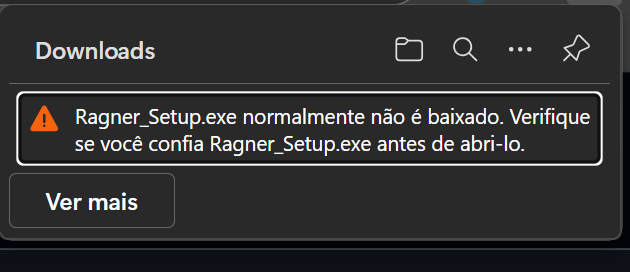
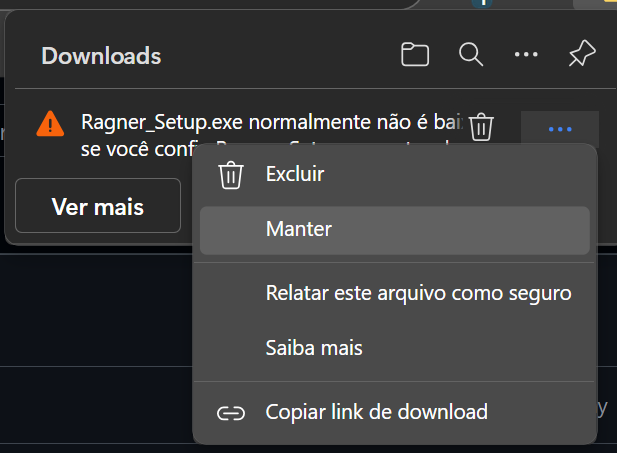
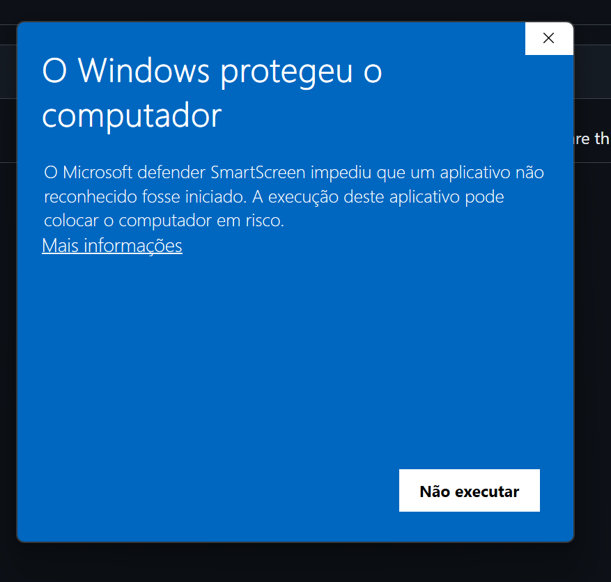
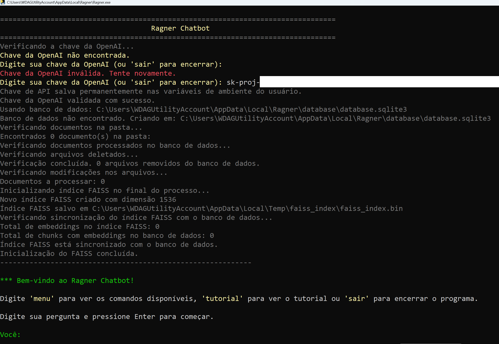

# Manual do Ragner - TCC Vinicius Buscacio

**Obrigado por participar! Bem-vindo(a) ao manual do RAGNER!**

Este manual vai te guiar no uso do software para o Trabalho de Conclusão de Curso sobre **RAG** (Retrieval-Augmented Generation). 

---

## 🎯 Antes de Começar

**LEMBRE-SE**: O TCC possui 3 etapas:

1. ❓ **Questionário 1**: https://forms.office.com/r/LCVe9xUbV3
2. 💻 **Usar este software** (instruções abaixo)
3. ❓ **Questionário 2**: https://forms.office.com/r/3hCccavjjV (após a utilização do software)

---

# 📦 Passo 1: Instalação

[](installer/Ragner_Setup.exe)

## Parte 1.1 - Baixe o arquivo `Ragner_Setup.exe` acima

O botão de download fica no canto superior direito:





Pode ser que o navegador e/ou o Windows reclamem deste download, porque este aplicativo não possui certificado da Microsoft. Basta clicar em permitir conforme imagens abaixo:





Caso apareça esta tela abaixo do Windows, basta clicar em Mais informações / Permitir:



## ❓ Porque estas mensagens de segurança?

Infelizmente, não possuo uma chave de desenvolvedor Windows, o que poderia me custar mais de R$ 1.000 por ano 😢

Este aplicativo é seguro, e não precisa de permissão de Administrador do computador. Ele não vai mexer no registro do Windows, e só vai copiar os executáveis para a pasta C:\Users\SEU USUÁRIO AQUI\AppData\Local\Ragner. O desinstalador vai deletar esta pasta no final.

Caso dejese rodar em ambiente virtual, sem problemas. Se você tiver o Windows Pro, recomendo o Windows Sandbox: (https://learn.microsoft.com/pt-br/windows/security/application-security/application-isolation/windows-sandbox/). Mas outras ferramentas como VMware, Virtual Box, e outros, também servem.

## Parte 1.2: Execute o instalador


## 📱 Interface do Programa

O Ragner funciona pelo terminal do Windows, como nas imagens abaixo:


**Após a instalação:**
- O programa abrirá automaticamente
- Criará 2 atalhos na sua Área de Trabalho:
  - ▶️ **Ragner** - para executar o programa
  - 📁 **Documentos Ragner** - pasta onde colocar seus arquivos

---

# 🔑 Passo 2: Configurar Chave OpenAI

**Quando executar o programa pela primeira vez**, ele pedirá uma chave OpenAI.



**Você tem 2 opções:**

## Opção A: Usar a Chave Fornecida (Recomendado)
Use a chave que lhe foi enviada no email ou Whatsapp.


## Opção B: Usar Sua Própria Chave
Se você tem conta OpenAI, pode usar sua própria chave (Open AI Key).

---

# Passo 3: Adicionar Documentos

## Passo 3.1: **Abra** a pasta "Documentos Ragner" (atalho na Área de Trabalho)
## Passo 3.2: **Copie** seus arquivos para esta pasta (PDF, Word ou TXT)
## Passo 3.3: **Volte** ao programa e digite o comando:

```
recarregar_arquivos_da_pasta
```
Este passo pode ser também fechar e reabrir o programa.

---

# 🚀 Passo 4: Usar o Software

Após digitar o comando de **recarregar_arquivos_da_pasta** , basta digitar perguntas relacionadas aos seus documentos. O Ragner vai te mostrar todo o processo que está ocorrendo até a resposta final.

---

## ❓ Comandos Úteis

Durante o uso, você pode digitar os seguintes comandos:

- `sobre` - Exibe informações sobre o Ragner
- `tutorial` - Exibe um tutorial sobre como usar o Ragner
- `configurar_api_key` - Configura uma nova chave de API da OpenAI
- `status` - Exibe o status geral do sistema
- `status_tabela_arquivos` - Exibe os arquivos indexados
- `status_tabela_chunks` - Exibe informações sobre os chunks
- `status_faiss` - Exibe informações sobre o índice FAISS
- `recarregar_arquivos_da_pasta` - Recarregar todos os arquivos da pasta 'documentos'
- `teste_vetor` - Transforma um texto em vetor para executar teste
- `apagar_tudo` - Apaga todos os dados do sistema
- `menu` - Exibe este menu de comandos
- `sair` - Encerra o programa

---

# 🔧 Solução de Problemas

## ❌ "Erro de chave OpenAI"
- Verifique se copiou a chave corretamente
- Digite `configurar_chave` para inserir novamente

## ❌ "Nenhum documento encontrado"
- Confirme que colocou arquivos na pasta "Documentos Ragner"
- Digite `recarregar_arquivos_da_pasta`

## ❌ Programa não abre
- Tente abrir pelo atalho da Área de Trabalho
- Reinstale o software

---

# Dicas para o TCC

1. **Teste diferentes tipos de pergunta** sobre seus documentos
2. **Observe** como o programa mostra cada etapa do RAG
3. **Explore o tutorial** para entender melhor o processo
4. **Anote suas impressões** para responder o Questionário 2

---

# Precisa de Ajuda?

Se tiver problemas, entre em contato comigo: 
- **Email**: [seu-email-aqui]


**Obrigado pela participação no TCC!**